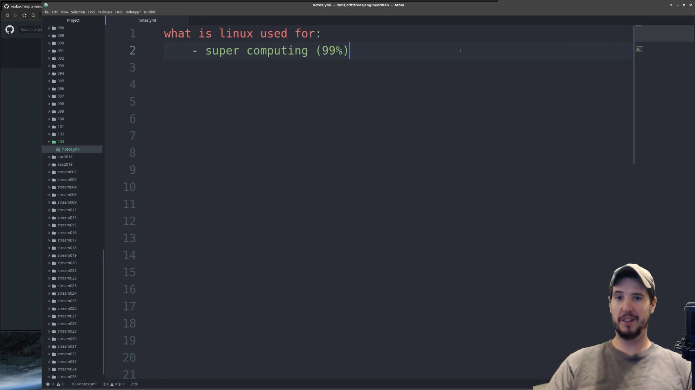
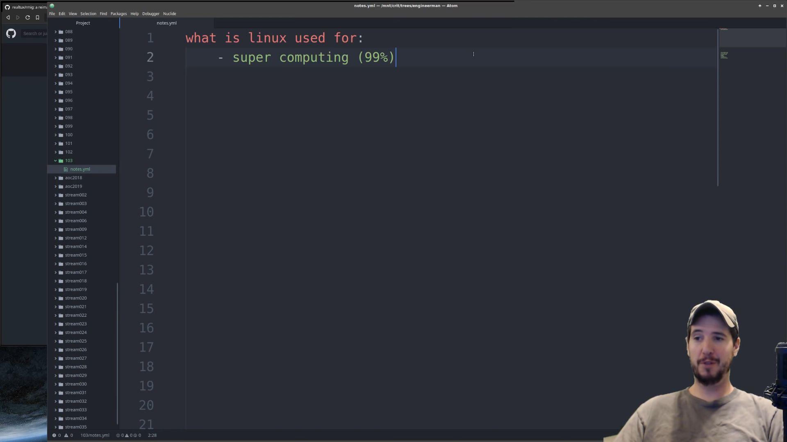
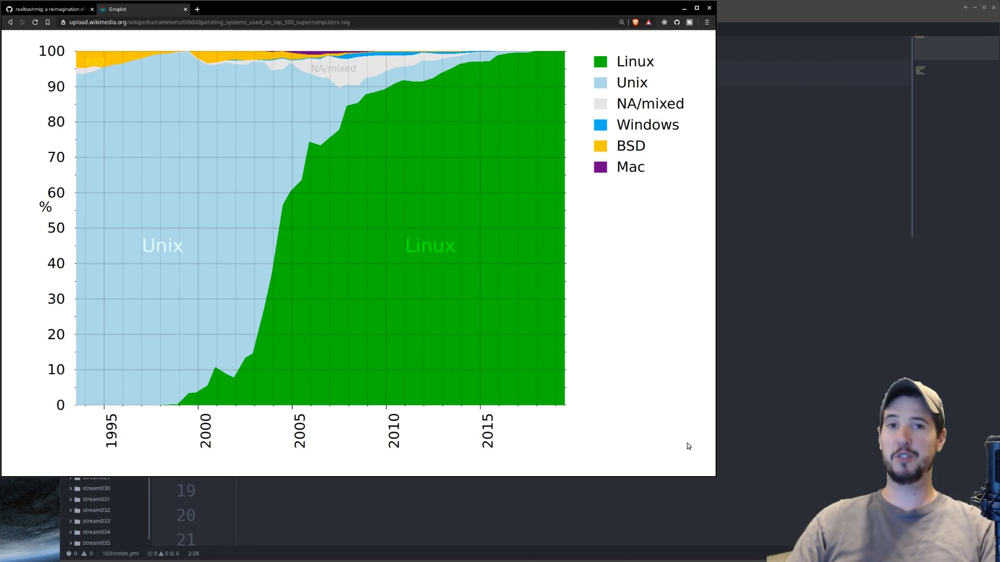
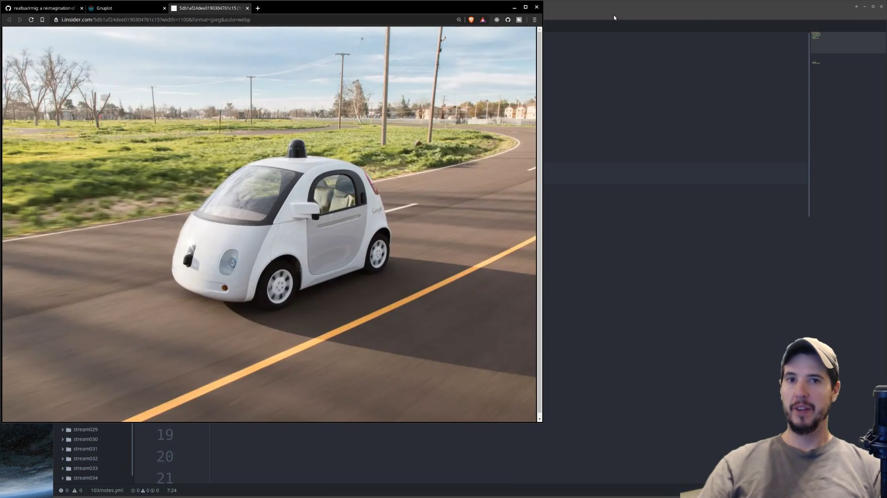
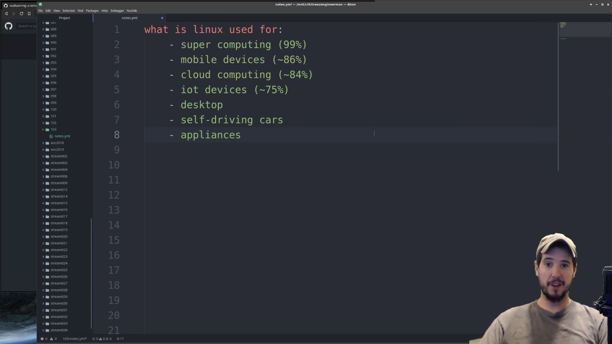
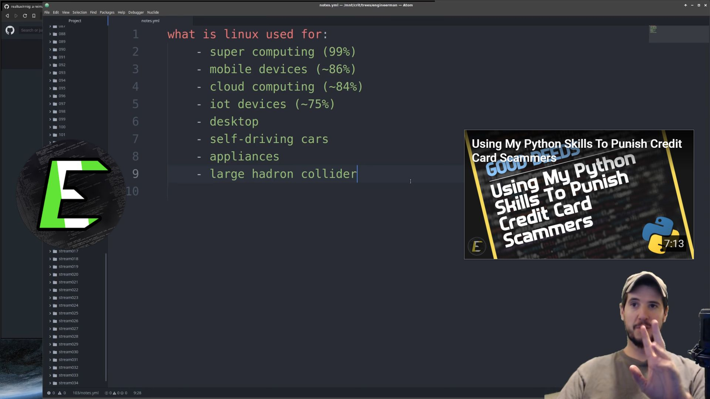

What's going on engineers.
 The question today is what is Linux 

used for.
 Let's talk about that, let's also talk about where you might use it and then also some common and uncommon places that you might find Linux, and this is one of your first Linux videos you're not even sure what it is you could pick up Linux as similar to Windows or Mac OS, with a few key differences, and the big differences are that Linux is a free and open platform and this free as in cost, but also in freedom, it's also a lot smaller, and it's also very flexible.
 And it's that flexibility is why it's used for so many things.
 In fact, there's a lot of people that use Linux every day without even realizing it, and we'll talk about that in a second.
 So let's get started.
 Before we get started I have several things and I've ordered them roughly in terms of how dominant Linux is in a given area, which brings us to the first thing Linux is used for and that's super computing, and this area is an area where Linux is the undisputed grand champion in terms of market share in 2020, at least 99% of all supercomputers are running Linux.
 The purpose number one spot was held by Unix and really there was no other platform that ever even came close to either Unix or Linux, nowadays came out in 1991 but it took about eight years for it to mature before it started being used in supercomputing.
 But once I got a foothold in that was there for UNIX, from 2000 to 2010 It went from 5% market share to 90% market share.
 That's a pure reason why Linux is adoption supercomputing was both broad and rapid but it comes down to one thing and that was the openness of the platform, being 

able to create a customized distribution just for supercomputing is hugely beneficial, and that's just something that Unix can't do the next year it seems says mobile devices, the largest most widely deployed mobile platform on planet earth, of course is Android.
 In terms of market share, it's probably a lot higher in 86% chose that number 

because that's just to Android only if you take other mobile device platforms such as postmarket OH S which is pure Linux as opposed to Android which is based on Linux and that number probably goes north of 90%.
 So if you own an Android phone then you benefit from Linux, every single day.
 The 

next thing Linux is used for and this is a huge one is cloud computing.
 In fact, this very video that you're watching right now is 100% for sure served to you by a Linux server somewhere in the cloud.
 It's hard to say exactly what the market share is here is thought to be about 84% for Linux and just to Google, Facebook, IBM, and Amazon alone have around 4 million servers, I have to imagine there's 10s of millions of servers worldwide maybe even 100 million and the vast majority of those are going to be running Linux.
 But to be sure this is an area where Linux is not completely dominant, there are huge data centers out there running Windows Server software, and there's several sites that run on Microsoft technologies.
 One of the main ones is Stack Exchange, although I think they only have about 100 servers.
 Another major area where Linux is found is IoT devices, and that's whether it's your ring doorbell on the front of your house, your google home your Amazon Alexa or the Nest thermostat on your wall, every single one of those things are running Linux, roughly 75% of all IoT devices are running Linux, then the remainder are probably just bare metal operating systems or something proprietary Linux is a real logical choice for IoT stuff because it's small and it already has a lot of the tech stacks available to do common things that you would do in an IoT device such as maybe Bluetooth or Wi Fi or interfacing with hardware or otherwise, for a manufacturing standpoint, who's designing a new IoT product and they want to offer it both quick and cheap, it makes sense to just pick Linux which already does a lot of the core stuff they're going to need.
 The next place to find Linux to use is as a replacement for something like Windows or Mac OS, you can use Linux on the desktop.
 In fact, right now I'm recording this video on Linux, and when I'm done recording I'm going to edit it on Linux.
 Unfortunately the Linux desktop market share is embarrassingly low and that's due to the fact that it is kind of user unfriendly although that improves as each year goes by, as a Linux enthusiast myself I always hold out hope that this year will be the year polemics desktop.
 The next place we'll find Linux is in self driving cars.
 And this is true of both Tesla's as well as the Google self driving car in the best drug cases outside of Google and 

Tesla if a car manufacturer is making a self driving platform, then they're going to be using Linux as its base.
 Did you know you can find Linux on things like washing machines and 

coffeemakers.
 Well, now you do that late model Samsung washing machine that you have that lets you check on your phone to see the stands that are closing around the world, you can bet that it's running Linux.
 And finally, and this one is really cool with the Large Hadron Collider runs on Linux across it's hundreds of 1000s of cores and it's 10s if not hundreds of petabytes of collision data, Linux, indeed did contribute to the discovery of the Higgs Boson particle.
 For those curious I believe they use the CERN developed scientific Linux.
 So the summary here is that Linux is prolific and it's used in so many different places for so many different things, and as the years go by the number of things continue to increase.
 If you have any questions about anything you saw in this video or if you want to share other places that you know Linux exist or how you use Linux I did it basis you should let me know in the comments below.
 Alright that next video take care.
  

